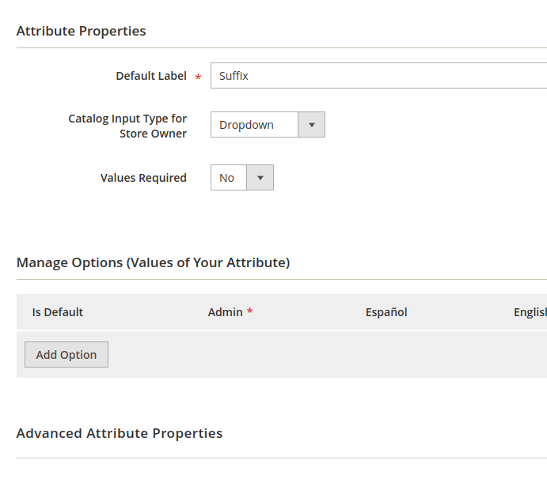

# Magento 2 Product Name Suffix

 - [Main Functionalities](#markdown-header-main-functionalities)
 - [Installation](#markdown-header-installation)
 - [Demo](#markdown-header-demo)

## Main Functionalities
This module allows to add a suffix to the product name.

## Installation
\* = in production please use the `--keep-generated` option

### Type 1: Zip file

 - Unzip the zip file in `app/code/JMC`
 - Enable the module by running `php bin/magento module:enable JMC_ProductNameSuffix`
 - Apply database updates by running `php bin/magento setup:upgrade`\*
 - Flush the cache by running `php bin/magento cache:flush`

## Demo

1. Add option to the suffix product attribute

2. Choose an option in the product edit page

3. Save the product

